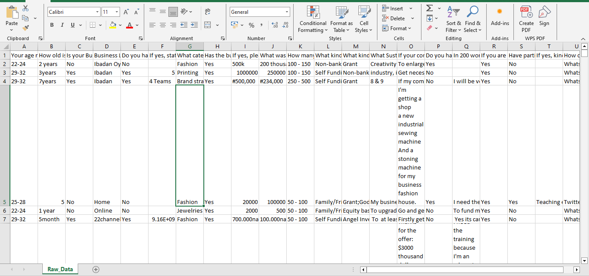
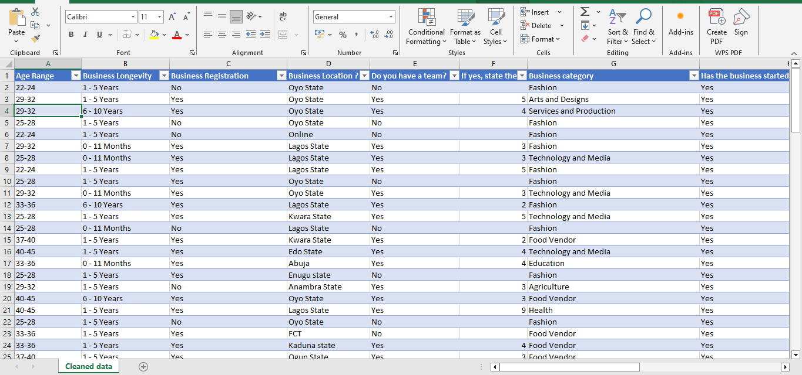
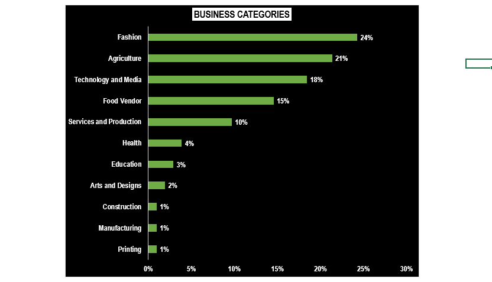
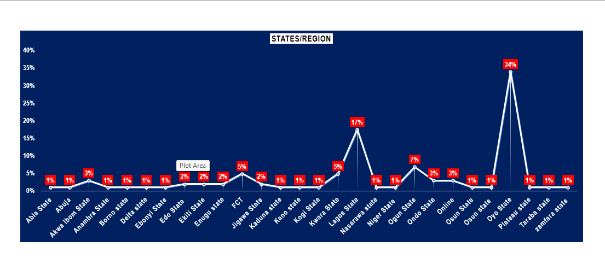

# ONE-Foundation-Cohort-1-Project-Analysis

## Table of Contents
- [Project Overview](#project-overview)
- [Project Objectives](#project-objectives)
- [Project Stakeholder](#project-stakeholder)
- [Data Source](#data-source)
- [Tools Used](#tools-used)
- [Data Preparation and Analysis Process](#data-preparation-and-analysis-process)
- [Exploratory Data Analysis (EDA)](#exploratory-data-analysis-eda)
- [RESULTS](#results)
- [Dashboard](#dashboard)
- [Recommendations](#recommendations) 
- [Conclusion](#conclusion)

## Project Overview

This data analysis project was commissioned by the **One Foundation Organisation** and aimed to develop an interactive and dynamic dashboard to analyze applicant data comprehensively. 
The project focused on applicants from all thirty-six (36) states of Nigeria who applied for the organization’s program themed **“Entrepreneurial Thinking”**.

## Project Objectives

The primary objective was to present an analysis report that would provide stakeholders with in-depth insights into the applicant pool, including:
1. Demographic distribution.
2. Engagement levels and response patterns.
3. Identification of emerging trends and behavioural patterns among applicants.
4. Informing data-driven decisions to optimize program delivery, future program outreach, and effectiveness.

## Project Stakeholder

The primary stakeholders for this project are the Board of Executives of the One Foundation Organisation, a non-governmental organization (NGO) based in Ibadan, Oyo State, Nigeria. 
The foundation is dedicated to empowering youth entrepreneurs across Nigerian universities by providing essential support services, including: Grants, Entrepreneurship training, Skill acquisition programs, and Networking opportunities.

## Data Source

The data for this project were sourced primarily through an online survey questionnaire. This survey was disseminated via various social media platforms including Facebook, WhatsApp, LinkedIn, Twitter, and Instagram to ensure widespread accessibility and ease of participation for respondents. 
The target respondents were youth entrepreneurs or entrepreneurial enthusiasts currently enrolled in universities across Nigeria. 
The online distribution of the survey enabled the collection of diverse, real-time data from a broad demographic, providing a comprehensive overview of the applicants' characteristics, interests, and engagement levels with the Entrepreneurial Thinking program.

## Tools Used

- Microsoft Excel: Data cleaning
- Microsoft Excel: Data analysis with pivot table and visualization
- Microsoft Excel: Interactive dashboard for report presentation 

## Data Preparation and Analysis Process

In the initial data preparation phase, I performed the following tasks:
- **Data Cleaning:** Excel was used for initial data cleaning, including removing duplicates, extra spaces, handling missing values, and standardizing formats.

**Raw data (Before data cleaning)**              |  **Raw data (After data cleaning)**
:----------------------------------------------: | :------------------------------:
                    |    
[Download data here](Raw_Uncleaned_Data.xlsx)    |  [Download data here](Cleaned_data.xlsx)

- Data Analysis: Pivot tables were utilized to perform comprehensive analysis, allowing for aggregating and summarizing key applicant metrics.
  
- Data Visualization: Charts and graphs were created within Excel to visually represent trends, distributions, and other key insights from the dataset.
  
- Interactive Dashboard: An interactive dashboard was developed using Excel's advanced features to present the data dynamically. This dashboard allowed stakeholders to easily view and explore the data based on their specific needs and interests [Download dashboard here](ONEF_Project.xlsx).

## Exploratory Data Analysis (EDA)

Exploratory Data Analysis (EDA) was conducted to uncover key insights and patterns within the applicant dataset, addressing several critical questions posed by the stakeholders. The analysis focused on providing actionable answers to the following queries:
1.	What are the distinct business categories represented in the applications, and what is the rate of application for each category (%)?
2.	What are the age demographics of the applicants?
3.	What is the business longevity of the applicants?
4.	What are the application trends across the 36 states of Nigeria?

## RESULTS

- ### Business Categories
The analysis identified 12 distinct business categories. The rate of applications for each category was calculated and visualized using a pivot chart to highlight percentage contributions. [Refer to pivot table.](ONEF_Project.xlsx)

- ### Age Demographics
Applicants were categorized into seven age groups, ranging from 18–20 years (least) to 40–45 years (highest). The visualization provides detailed insights into the age distribution across the applicant pool. [Refer to pivot table.](ONEF_Project.xlsx)

- ### Business Longevity
Applicants’ business longevity, referring to how long their businesses have been established. The analysis highlighted four business longevity categories, including the level of engagements (%) [Refer to pivot table.](ONEF_Project.xlsx) as follows:
1.	0–11 months: 13%
2.	1–5 years: 74% 
3.	6–10 years: 10%
4.	11 years and above: 3%

- ### Application Trends by Location
Applications were received from all 36 states of Nigeria [Refer to pivot table](ONEF_Project.xlsx). Key highlights include:
- Oyo State: The highest number of applicants (34%)
- The lowest number of applicants (1%) from 16 out of the 36 states

## Dashboard

Interactive and responsive dashboard [Download Dashboard](ONEF_Project.xlsx).

## Recommendations
1.	Targeted Outreach: Increase awareness in underrepresented states like Abia through local campaigns and partnerships with universities.
2.	Program Customization: Develop beginner-focused content for younger applicants and advanced sessions for those with longer business longevity.
3.	Resource Allocation: Prioritize logistics and resources in states with higher applicant numbers, like Oyo State.
4.	Dashboard Updates: Regularly update the dashboard with new data and train teams for effective usage.

## Conclusion
The analysis provided actionable insights into applicant demographics, trends, and preferences, enabling the One Foundation Organisation to tailor its program for maximum impact. The interactive dashboard equips stakeholders with a powerful tool for data-driven decision-making, ensuring efficient program delivery and improved outreach. By leveraging these findings, the organization can better achieve its mission of empowering youth entrepreneurs across Nigeria.

🙂😃💻

